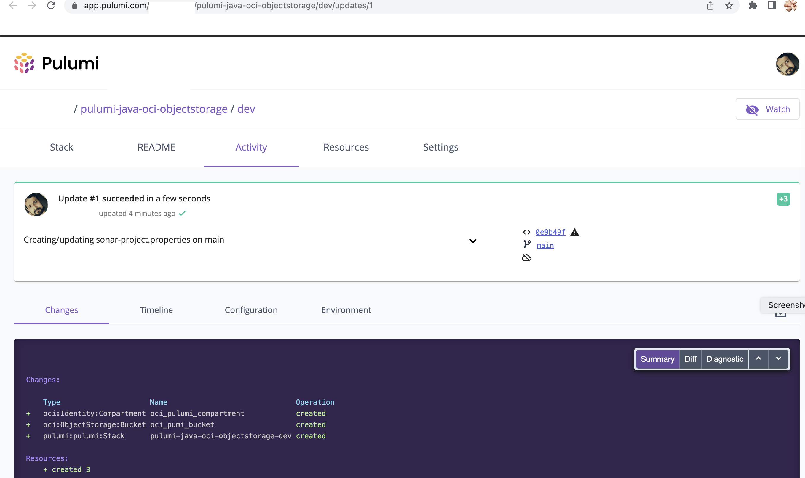

OCI Pulumi Objectstorage   - With JAVA.
------

[](https://img.shields.io/badge/license-UPL-green) [](https://sonarcloud.io/dashboard?id=oracle-devrel_pulumi-java-oci-objectstorage)

This is an OCI Pulumi java code that deploys [Object storage bucket](https://docs.oracle.com/en-us/iaas/Content/Object/Concepts/objectstorageoverview.htm) on [Oracle Cloud Infrastructure (OCI)](https://cloud.oracle.com/en_US/cloud-infrastructure).

## About
Oracle Cloud Infrastructure Compute lets you provision and manages to compute hosts, known as instances. You can create instances as needed to meet your compute and application requirements. After you create an instance, you can access it securely from your computer, restart it, attach and detach volumes, and terminate it when you're done with it. Any changes made to the instance's local drives are lost when you terminate it. Any saved changes to volumes attached to the instance are retained.

## Prerequisites
1. Download and install Pulumi CLI - https://www.pulumi.com/docs/get-started/install/
2. If not installed, download and install [Java 11 or Later](https://www.oracle.com/java/technologies/downloads) and [ Apache Maven 3.6.1 or later](https://maven.apache.org/install.html)
3. Oracle credentials for Pulumi - https://www.pulumi.com/registry/packages/oci/installation-configuration/
4. To  manage pulumi stack with stage-managed by pulumi itself, to so creating an account on Pulumi via - https://app.pulumi.com/
5.
## How to deploy

- Validate the execution of Pulumi CLI - `pulumi version`
- Validate Java version - `java -version`
- Validate Maven version - `mvn -version`

- Create a folder for the code and switch into it.
```java
$ mkdir pulumi-java-oci-objectstorage
$ cd pulumi-java-oci-objectstorage
```
- Login to pulumi
  - Run  `pulumi login` and follow the instruction. - https://www.pulumi.com/docs/reference/cli/pulumi_login/
  - You can create a personal access token via the URL and copy it back to the pulumi login prompt as well.


- Create a new pulumi stack - `pulumi new https://github.com/oracle-devrel/pulumi-java-oci-objectstorage`
- You may have to use with `--force` option if the workspace is not empty.
- Provide `pulumi-java-oci-object-storage` as the project name and `dev` as the stack name.


- Configure the access authorizations for pulumi. You can add them as encrypted secrets or as environment variables. Please note the value of the region must same as that of your OCI Home region(as we are creating a new compartment).

`- As encrypted secrets (Within pulumi config control/Not with OCI Vault)

```java
pulumi config set oci:tenancyOcid "ocid1.tenancy.oc1..<unique_ID>" --secret
pulumi config set oci:userOcid "ocid1.user.oc1..<unique_ID>" --secret
pulumi config set oci:fingerprint "<key_fingerprint>" --secret
pulumi config set oci:region "xxx"
# Set the private key from standard input to retain the format
cat "PATH TO PEMFILE " | pulumi config set oci:privateKey --secret
```
- Or as Environmental values.
```java
export TF_VAR_tenancy_ocid="ocidN.tenancy.oc1..<unique_ID>"
export TF_VAR_user_ocid="ocidN.user.ocX..<unique_ID>"
export TF_VAR_fingerprint="<key_fingerprint>"
export TF_VAR_region=<OCI Region>
export TF_VAR_private_key_file="/path/to/oci_api_key.pem"
```
- Once done you should see your stach configuration similar to below.


- You can override the variables using the pulumi config command.

```java
Example:
$ pulumi config set objectstorage_bucket_name "MyObjectstore"
```

- Validate the configuration by running `pulumi pre`.In case of any JAVA or Maven-related error, validate and adjust the requirements and config [pom. xml](pom. xml).


- Apply the stack using `pulumi up`


- Use the keyboard `DOWN` arrow and view the details.


- Use the keyboard `UP` arrow and select `yes`.Wait for the completion of all the tasks.


- Validate the resources via [OCI Console](https://cloud.oracle.com) 

- You can click on the `View Live` link to view the status and details via app.pulumi.com.



- Delete the stack using `pulumi destroy` view `Details` and provide confirmation(`Yes`).


- Wait for the completion (The compartment deletion would take 2 to 5 minutes).


Optionally,
- Delete stack files - `pulumi stack rm pulumi-java-oci-objectstorage`
- Logout from pulumi - `pulumi logout`

## Read more

- https://www.pulumi.com/registry/packages/oci/installation-configuration/

## Contributors

- Author: [Rahul M R](https://github.com/RahulMR42).
- Collaborators: NA
- Last release: July 2022

## Contributing
This project is open source.  Please submit your contributions by forking this repository and submitting a pull request!  Oracle appreciates any contributions that are made by the open-source community.

## License
Copyright (c) 2022 Oracle and/or its affiliates.

Licensed under the Universal Permissive License (UPL), Version 1.0.

See [LICENSE](LICENSE) for more details.

ORACLE AND ITS AFFILIATES DO NOT PROVIDE ANY WARRANTY WHATSOEVER, EXPRESS OR IMPLIED, FOR ANY SOFTWARE, MATERIAL OR CONTENT OF ANY KIND CONTAINED OR PRODUCED WITHIN THIS REPOSITORY, AND IN PARTICULAR SPECIFICALLY DISCLAIM ANY AND ALL IMPLIED WARRANTIES OF TITLE, NON-INFRINGEMENT, MERCHANTABILITY, AND FITNESS FOR A PARTICULAR PURPOSE.  FURTHERMORE, ORACLE AND ITS AFFILIATES DO NOT REPRESENT THAT ANY CUSTOMARY SECURITY REVIEW HAS BEEN PERFORMED WITH RESPECT TO ANY SOFTWARE, MATERIAL OR CONTENT CONTAINED OR PRODUCED WITHIN THIS REPOSITORY. IN ADDITION, AND WITHOUT LIMITING THE FOREGOING, THIRD PARTIES MAY HAVE POSTED SOFTWARE, MATERIAL OR CONTENT TO THIS REPOSITORY WITHOUT ANY REVIEW. USE AT YOUR OWN RISK. 


 

